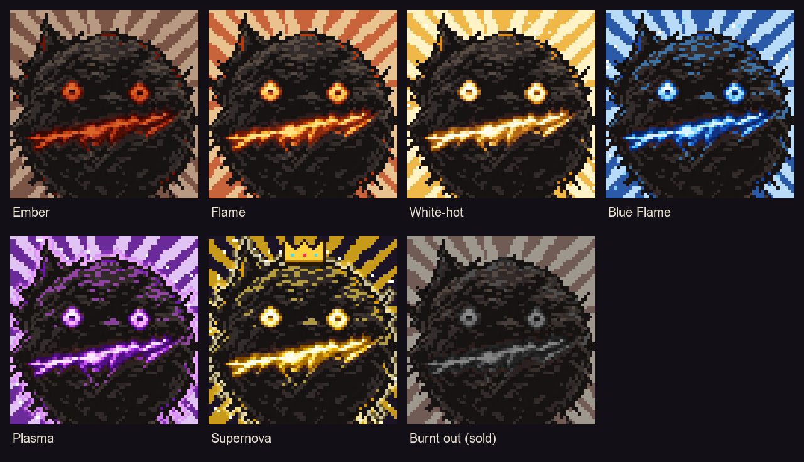

# RockHook ($ROCK)

RockHook is a Solana token with a supply of 777 $ROCK, launched on a Meteora bonding curve. A transfer hook forges every buy on the curve into a Rocky NFT whose tier is its flame temperature. The collection closes for good when the curve graduates at a $200K market cap.

## Layout

- `index.html` – the whole site (static, no build step). Deploy the repo root as-is on Vercel and point `rockhook.fun` at it. The My Rockies tab reads the chain directly once the mint address is set in its `CONFIG`.
- `art/` – 64×64 tier images used by the site (scaled up with pixelated rendering).
- `nft/base.png` – the original drawing.
- `nft/generate.py` – rebuilds every tier from `base.png`: 1024px images in `nft/tiers/`, the 64px copies in `art/`, and `nft/rarity-sheet.png`. Requires Pillow: `python nft/generate.py`.
- `program/` – the transfer hook program, the forge bot and the end-to-end tests. See [program/README.md](program/README.md).

## Tiers

| Tier | $ROCK received in one buy | Flame |
|---|---|---|
| Ember | under 0.77 | ≈ 900 K |
| Flame | 0.77 to 1.77 | ≈ 1,300 K |
| White-hot | 1.77 to 3.77 | ≈ 1,800 K |
| Blue Flame | 3.77 to 7.77 | ≈ 2,200 K |
| Plasma | 7.77 or more | ≈ 10,000 K |
| Supernova | 3, each 1 of 1: the buy that fills the curve, the biggest buyer on the curve (the runner-up if that buyer's biggest buy is the one that fills it), and a random draw among the Rockies still lit | ≈ 10⁹ K |
| Burnt out | the wallet sold or sent $ROCK before graduation | cold ash |

Buys under 0.1 SOL don't forge a Rocky. The same SOL buys more $ROCK early on the curve, so early buys burn hotter.

## Why 777

777 °C is forge heat. It sits just past 770 °C, the Curie point of iron, where hot steel stops sticking to a magnet and a blacksmith knows it's ready to be hardened. That's the moment a lump of metal becomes something that keeps its shape, which is what the hook does to every buy. The sevens run through the rest too: a Rocky can end in seven states (five flames, the Supernova and the ash), and the tiers step up at 0.77, 1.77, 3.77 and 7.77 $ROCK.

## Status

The hook program and the forge bot are built and pass every test on a local validator running the real Meteora and Metaplex programs. They are not deployed to mainnet yet; the addresses go on the site at launch.
